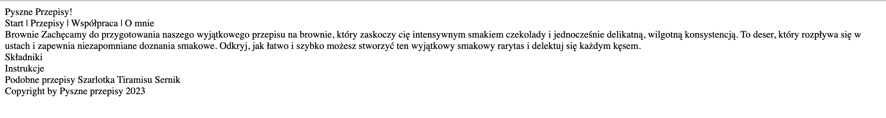

# Zadanie - HTML 01

1. Zmodyfikuj plik `index.html` w taki sposób, aby był poprawnym plikiem HTML

2. Powinien wyglądać w ten sposób:
    

3. Sprawdź czy nie ma błędów korzystając z [https://validator.w3.org/](https://validator.w3.org/)